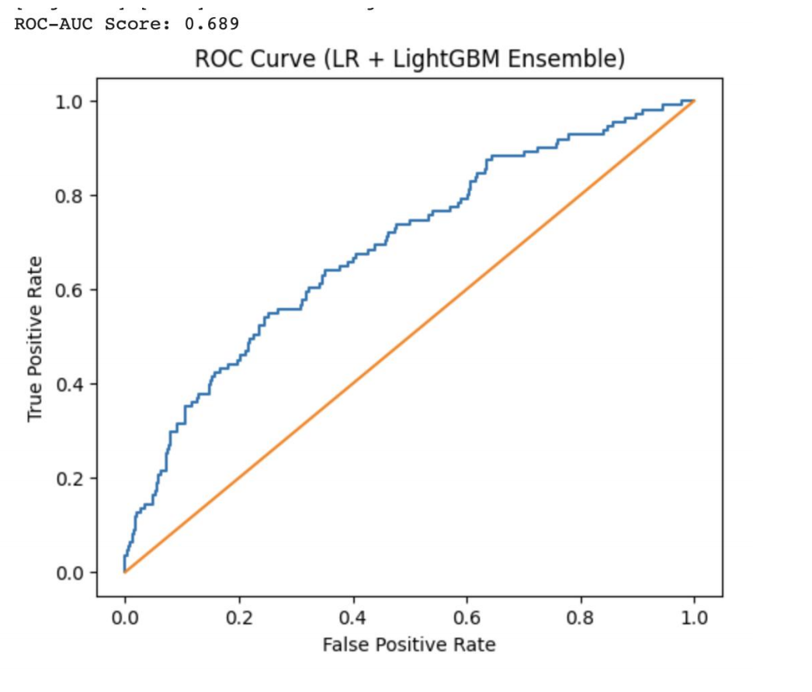
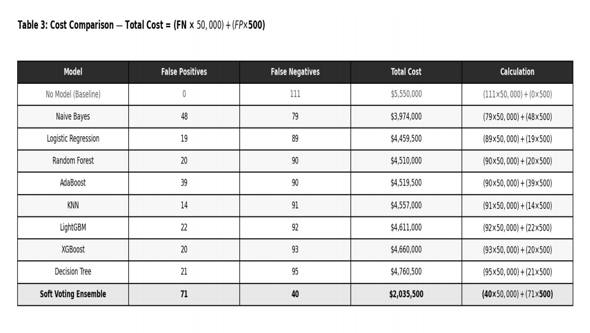
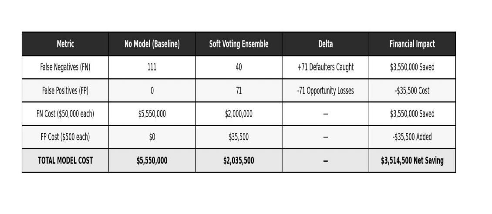

# Credit Default Prediction using Machine Learning

## Comparative Analysis of Classification Models for Credit Risk Assessment

This repository presents a **machine learning-based framework **for predicting c**ustomer credit default** by comparing multiple supervised classification algorithms and developing an optimized ensemble model. The project focuses on minimizing financial loss through data-driven credit risk prediction and business-oriented model evaluation.

---

# Project Overview

Credit default prediction plays a critical role in helping financial institutions reduce lending risk and improve decision-making. This project evaluates multiple machine learning algorithms to identify the most effective model for predicting borrower default.

Unlike conventional studies that prioritize accuracy alone, this project incorporates financial cost analysis to recommend the most practical model for real-world deployment.

---

# Business Objective

The objectives of this project are to:

- Predict whether a customer will default within the next 12 months.
- Compare multiple supervised machine learning algorithms.
- Rank models using multiple evaluation metrics.
- Develop an optimized ensemble learning model.
- Minimize financial losses caused by incorrect predictions.

---

# Dataset

The dataset consists of borrower financial and behavioural information.
https://github.com/Jenifa-03/Credit_Default_Prediction_ML/blob/d1aa0806adee6b56a4e690b357ef2e4a91be8b19/credit_default.xlsx

### Features

- Monthly Income
- Monthly EMI
- EMI-to-Income Ratio
- Credit Score
- Loan Tenure
- Past Delinquencies

### Target Variable

**Default_12M**

- 1 = Default
- 0 = No Default

Dataset preprocessing includes:

- Data cleaning
- Train-test split
- Feature scaling
- Standardization

---

# Machine Learning Models Evaluated

The following classification algorithms were implemented and compared:

- Logistic Regression
- Naive Bayes
- K-Nearest Neighbors (KNN)
- Decision Tree
- Random Forest
- AdaBoost
- Gradient Boosting
- XGBoost
- LightGBM

---

# Evaluation Metrics

The models were evaluated using:

- Accuracy
- Precision
- Recall
- F1-Score
- ROC-AUC

Model comparison emphasized business relevance by prioritizing Recall and ROC-AUC to reduce high-cost False Negative predictions.

<p align="center">
  
</p>
---

# Model Selection Strategy

Instead of selecting a model based solely on accuracy, this project applies the **Borda Count Ranking Method** using multiple evaluation metrics.

<p align="center">
  
</p>

Ranking Criteria

- Recall
- Precision
- ROC-AUC

This multi-criteria approach provides a balanced and objective model selection process.

---

# Ensemble Learning

Three ensemble approaches were explored:

- Hard Voting
- Soft Voting
- Stacking
  <p align="center">
  
</p>

### Final Model

Soft Voting Ensemble

Base Models

- Logistic Regression
- LightGBM

Decision Threshold

0.35

---

# Business Cost Analysis

A financial cost framework was incorporated to evaluate the practical impact of prediction errors.

Cost Function

- False Negative = $50,000
- False Positive = $500

The optimized ensemble model substantially reduced False Negatives, resulting in significantly lower financial loss compared to individual models.

<p align="center">
  
</p>

<p align="center">
  
</p>

<p align="center">
  
</p>

---

# Key Results

- Compared nine machine learning classification models.
- Ranked models using the Borda Count methodology.
- Developed an optimized Soft Voting Ensemble.
- Improved Recall while reducing False Negatives.
- Reduced overall business cost through optimized classification.

---

# Technologies Used

| Technology | Purpose |
|------------|---------|
| Python | Machine Learning Development |
| Pandas | Data Processing |
| NumPy | Numerical Computing |
| Scikit-learn | Machine Learning |
| XGBoost | Gradient Boosting |
| LightGBM | Ensemble Learning |
| Matplotlib | Visualization |
| Seaborn | Statistical Visualization |
| Jupyter Notebook | Model Development |
| GitHub | Version Control & Documentation |

---

# Repository Structure

```text
Credit-Default-Prediction
│
├── README.md
├── Model_Evaluation.ipynb
├── credit_default.xlsx
├── Model_Evaluation_Report.pdf
├── Figures
│   ├── ROC_Curve.png
│   ├── Cost_Comparison.png
│   ├── Ensemble_Model.png
│   └── Other Visualizations

```

---

# Project Files

This repository contains:

- Machine Learning Notebook
- Dataset
- Project Report
- Model Evaluation Results
- Business Cost Analysis

---

# Academic Project

This repository showcases an **academic group project** completed as part of the **Machine Learning course** at **Jagdish Sheth School of Management (JAGSoM)**.

The project was completed collaboratively as part of the academic curriculum.

---

# My Contributions

My primary contributions to this project include:

- Designed the overall machine learning methodology.
- Performed data preprocessing and feature engineering.
- Implemented all machine learning classification models.
- Developed and evaluated the Soft Voting Ensemble model.
- Conducted comparative model analysis using multiple evaluation metrics.
- Performed business cost analysis for model selection.
- Prepared the complete project report.
- Created and maintained the GitHub repository and project documentation.

---

# Acknowledgement

This project was completed as part of a collaborative academic assignment. The project report included in this repository retains all team members' names to acknowledge their contributions. This repository specifically highlights my individual technical contributions while giving appropriate credit to the entire project team.

---

# Learning Outcomes

Through this project, I strengthened practical skills in:

- Machine Learning
- Classification Algorithms
- Ensemble Learning
- Credit Risk Analytics
- Data Preprocessing
- Feature Engineering
- Business Cost Optimization
- Model Evaluation
- Financial Risk Analysis
- Data Storytelling

---

# Future Enhancements

- Hyperparameter Optimization
- Explainable AI using SHAP
- SMOTE for class imbalance
- Streamlit Deployment
- Real-time Credit Risk Prediction API
- Automated Model Monitoring

---

# Author

**Jenifa X**

PGDM – Business Analytics 

Jagdish Sheth School of Management (JAGSoM)

**GitHub:** https://github.com/Jenifa-03

**LinkedIn:** www.linkedin.com/in/jenifa-x

---

# License

This repository is shared for academic learning and portfolio purposes. The report included in this repository acknowledges all members of the original academic project team. The repository primarily showcases my technical contributions to the project, including methodology design, machine learning implementation, report preparation, and project documentation.
